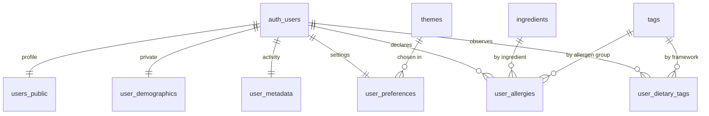
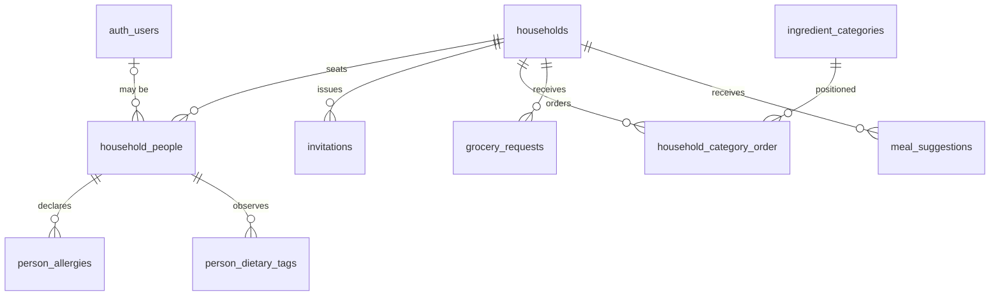
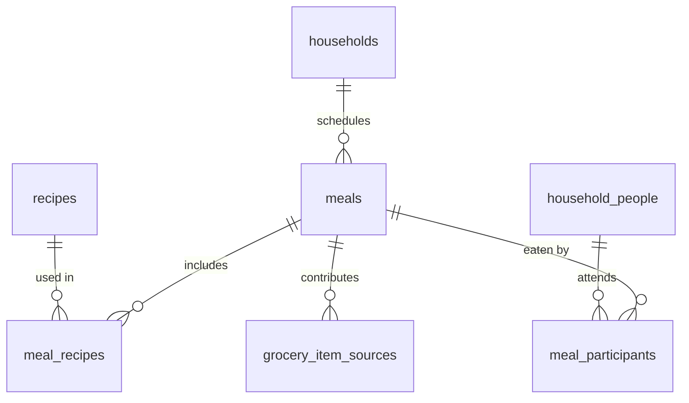
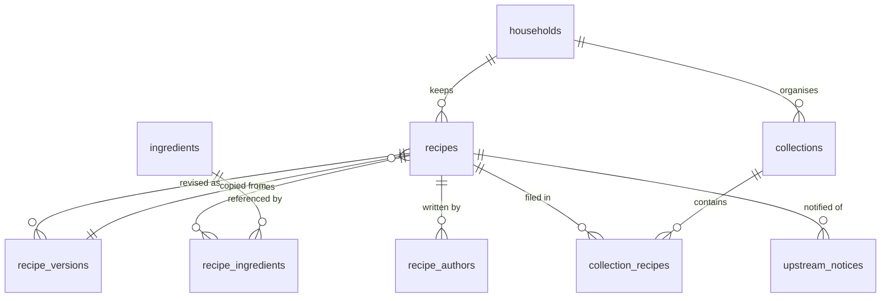
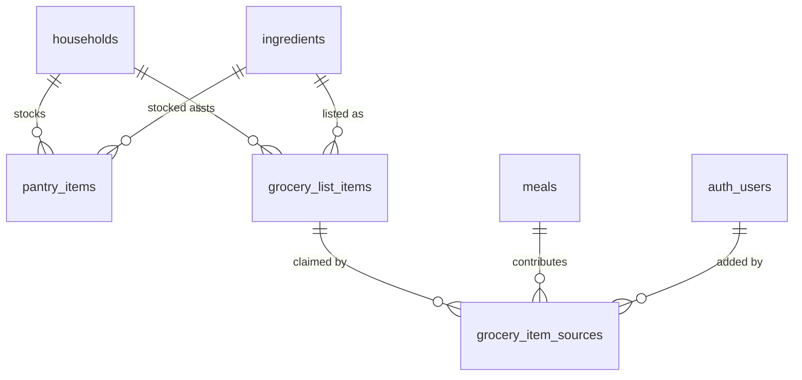
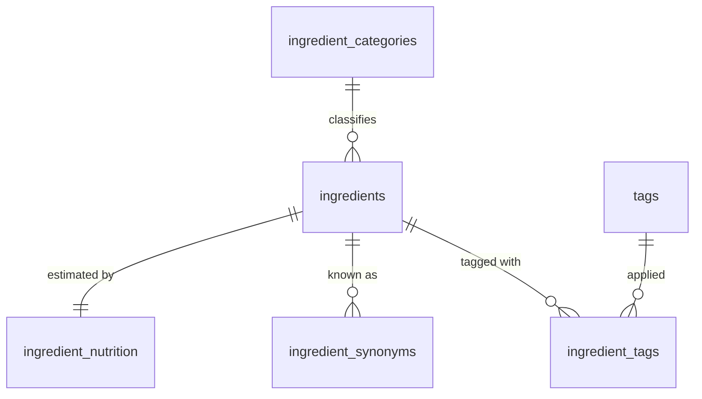
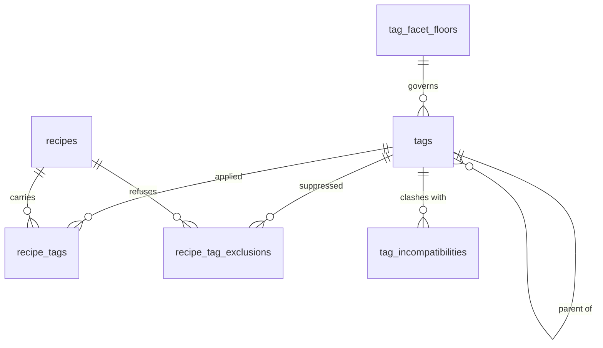
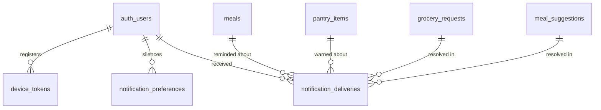
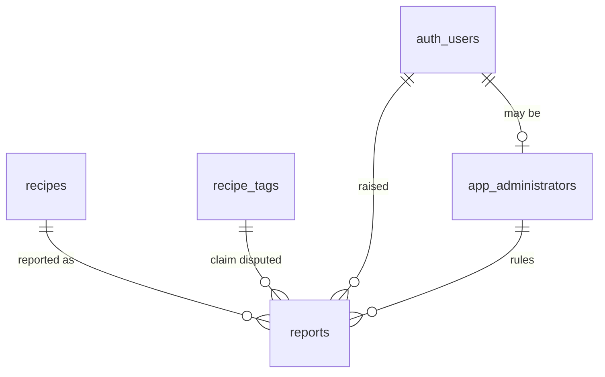

# Data

This file describes the following:
- Technologies used for data hosting and management.
- Partitioning of the dev/test/prod data environments.
- Data model and ERD for the application

## Technologies

Ladle's entire data tier runs on **Supabase Cloud**. Rather than assembling a
database, an identity provider, a blob store, and a function runtime from
separate vendors, we take all four from one managed platform so that a single
JWT authorizes every one of them and a single Postgres row-level security (RLS)
policy set is the authorization boundary for the whole system.

### Overview

| Concern | Technology | Where it runs |
| --- | --- | --- |
| Relational store | Supabase Postgres | Supabase Cloud |
| Identity and sessions | Supabase Auth (GoTrue) | Supabase Cloud |
| Binary assets | Supabase Storage | Supabase Cloud (S3-backed) |
| Server-side logic | Supabase Edge Functions (Deno) | Supabase edge network |
| Live updates | Supabase Realtime | Supabase Cloud |
| Schema management | Supabase CLI migrations | Repository + CI |
| Client data access | `supabase-js` + TanStack Query | React Native (Expo) |

### Postgres

Postgres is the system of record for all application data: users, pantries,
pantry items, recipes, meal plans, and nutrition entries. The mobile client does
not talk to Postgres over the wire protocol; it talks to **PostgREST**, the
auto-generated REST layer Supabase puts in front of the database, through
`supabase-js`.

Two consequences follow from that, and they shape everything else in this
document:

- **RLS is the authorization model, not an add-on.** Because the client issues
  its own queries against PostgREST, every user-owned table has RLS enabled with
  policies keyed to `auth.uid()`. A table without RLS enabled is a data breach,
  so enabling it is part of the same migration that creates the table.
- **The `service_role` key never ships in the mobile bundle.** It bypasses RLS
  entirely. It lives only in Edge Function secrets and CI. The app ships the
  `anon` key, which is public by design and useless without a valid session.

Database-side logic — constraints, generated columns, triggers, and
`security definer` functions for the few operations that need to cross a user
boundary — is preferred over client-side enforcement, since the client is not a
trusted participant.

### Auth

Supabase Auth issues short-lived JWTs that carry the user's ID and role. Postgres
verifies them, which is what makes `auth.uid()` available inside RLS policies,
and Storage and Realtime honor the same token.

On React Native the client is configured to persist sessions in device storage
and refresh them in the background:

```ts
createClient(url, anonKey, {
  auth: {
    storage: AsyncStorage,      // or expo-secure-store for the refresh token
    persistSession: true,
    autoRefreshToken: true,
    detectSessionInUrl: false,  // required: there is no URL to parse on native
  },
})
```

Token refresh is tied to the app's foreground state via an `AppState` listener
(`startAutoRefresh` / `stopAutoRefresh`), so a backgrounded app is not burning
refresh cycles and a resumed app is not holding an expired token.

### Storage

User-uploaded images live in Supabase Storage, which is S3-backed and exposes
its objects through the `storage.objects` table — meaning bucket access is
governed by the same RLS mechanism as application data.

Planned buckets:

| Bucket | Contents | Access |
| --- | --- | --- |
| `recipe-photos` | Photos attached to user recipes | Private; owner read/write |
| `pantry-items` | Snapshots of pantry stock | Private; pantry-member read |
| `avatars` | Profile images | Public read; owner write |

Private objects are served to the client through short-lived signed URLs.
Thumbnails use Storage's on-the-fly image transformation rather than generating
and storing derivative sizes ourselves.

### Edge Functions

Deno-based functions deployed with `supabase functions deploy`, used for work
that cannot or should not happen on the device:

- **Third-party nutrition lookups.** Barcode and food-database queries hit
  vendor APIs whose keys must stay server-side.
- **Scheduled pantry maintenance.** Expiry sweeps and reminder generation,
  invoked on a schedule via `pg_cron`.
- **Webhook receivers.** Inbound callbacks from external services, verified and
  written into Postgres with the `service_role` key.

Functions receive the caller's JWT and, by default, act as that user so RLS still
applies. Escalating to `service_role` is a deliberate, commented decision at each
call site.

### Realtime

Supabase Realtime streams Postgres changes to subscribed clients over a
WebSocket. It is used narrowly — for shared pantries and collaborative meal
plans, where a second household member's edit should appear without a pull to
refresh — rather than as the general read path.

Tables that need it are added to the Realtime publication explicitly in a
migration. Subscriptions run on the authenticated channel so RLS filters the
change stream per user; a client is never sent a row it could not have selected.

### Schema management

Schema is versioned as SQL in the repository and applied with the Supabase CLI.
There is no ORM and no dashboard-authored schema: Studio is for inspection, not
for changes.

```
supabase/
  migrations/
    20260824120000_create_pantries.sql
    20260824120500_pantries_rls.sql
  config.toml
  functions/
```

The workflow:

1. `supabase migration new <name>` scaffolds a timestamped SQL file.
2. Tables, indexes, RLS policies, functions, and triggers are written into it by
   hand — policies live in the same migration as the table they protect.
3. `supabase db reset` replays every migration against the local Docker Postgres,
   proving the migration chain builds from empty.
4. Migrations reach a hosted database twice: replayed from empty when a preview
   branch is created, and applied to production with `supabase db push` behind
   the approval gate described in *Migration promotion*.

TypeScript types for the client are generated from the live schema with
`supabase gen types typescript` and committed, so a schema change that breaks the
app fails at compile time rather than at runtime.

### Client data access

The app holds one `supabase-js` client as a module singleton. Every read goes
through **TanStack Query**, which supplies caching, deduplication, retry, and
optimistic updates; no screen calls `supabase-js` directly from a component.

- **Query keys** mirror the resource hierarchy (`['pantry', pantryId, 'items']`)
  so a mutation can invalidate exactly the affected subtree.
- **Cache persistence** to MMKV via `persistQueryClient` gives warm starts and
  read-only offline: a user who opens the app without a connection sees their
  last-known pantry and meal plan instead of an empty state.
- **Mutations** apply optimistically against the cache and reconcile on the
  server response, which keeps interactions such as checking off a pantry item
  feeling immediate.

**Known limitation:** this design is offline-*tolerant*, not offline-*first*.
Reads are served from cache without a connection; writes require one. If offline
writes become a requirement — the grocery-store-dead-zone case is the likely
forcing function — the change is to introduce a local SQLite replica with
bidirectional sync (PowerSync or equivalent) beneath the same TanStack Query
surface, rather than to rework the screens.


## Environment partitioning

Ladle runs three environments, and only one of them is permanently hosted.
Development happens against a local Supabase stack on the developer's machine,
**production** is a Supabase Cloud project, and the environment between them is
a **preview branch** — a hosted database provisioned from the migration chain
for as long as a release candidate is being tested, then destroyed.

| Environment | Postgres | Data | Consumed by | Lifetime |
| --- | --- | --- | --- | --- |
| Local | Docker, via `supabase start` | Synthetic seed | Expo dev client on the LAN | The working session |
| Preview | Supabase branch off `ladle-prod` | Synthetic seed + QA data | EAS `preview` builds (internal distribution) | The release candidate |
| Production | Hosted project `ladle-prod` | Real user data | EAS `production` builds (App Store / Play) | Permanent |

The boundary that matters is between preview and production. A branch is a
distinct database with its own URL, API keys, storage buckets, and Auth user
pool. Nothing is shared — a preview account does not exist in production, and a
preview bucket policy cannot expose a production object.

A branch is built from the migration chain and `seed.sql`, never from a copy of
production. That is worth stating as a property rather than a practice: where a
long-lived staging project *could* in principle be restored from a production
dump, there is no version of provisioning a branch that reaches production data
at all. `NFR-DATA-06` holds by construction here rather than by discipline.

### Local

`supabase start` brings up the full stack in Docker — Postgres, Auth, Storage,
Realtime, the Edge Function runtime, Studio, and a local inbox for auth emails —
so a developer can work through signup, image upload, and realtime flows without
touching a hosted project.

`supabase db reset` drops the local database, replays every migration in order,
and applies `supabase/seed.sql`. That single command is the definition of a
clean environment, and running it is how a developer confirms their migration
chain builds from empty before opening a pull request.

Pull requests are validated in CI by doing the same thing: standing up the
Supabase stack in the runner, replaying migrations and seed, and running the test
suite against it. Hosted branches exist and are deliberately *not* used for this.
A container in the runner is faster, costs nothing, and is the environment
`NFR-DATA-04` is actually a claim about; paying per hour to run the same
assertions against the network would buy fidelity the test suite does not
exercise.

### Preview

A Supabase branch off `ladle-prod`, inheriting its configuration — same
extensions, same Auth providers, same bucket layout, same Edge Functions — and
none of its data.

Preview exists to answer questions local development cannot. It is where hosted-
only behavior is exercised for the first time: third-party OAuth redirects,
outbound email through the real SMTP provider, Storage image transformation,
Edge Functions running on the edge network rather than in a local container, and
`pg_cron` schedules actually firing. It is also where a release build is
smoke-tested end to end before it is promoted.

**It is ephemeral, and that is the point twice over.** Branch compute is billed
by the hour it exists, so a permanent one would spend most of the monthly ceiling
in [`operating-model.md`](./operating-model.md) sitting idle overnight. But the
cost is only what made the question worth asking. A long-lived staging project
accumulates QA data and hand-applied fixes until it is no longer a faithful
statement of what the migration chain builds, and it drifts silently, because
nothing about a working staging environment announces that it stopped being
reproducible. A branch is replayed from empty every time it is created, which
makes every release candidate an execution of `NFR-DATA-04` on hosted
infrastructure rather than only in a container.

**What it costs is a stable address.** A preview build carries the branch URL and
key inlined at build time, so it stops working when the branch is destroyed. That
is accepted rather than mitigated: a preview build is a release candidate under
test, not a distribution channel, and one that outlives its database is testing
nothing. The branch is created before the build is cut and destroyed after the
candidate ships or is abandoned.

**The residual risk is per-branch configuration.** Anything holding an allow-list
of URLs — OAuth redirect targets above all — has to admit each new branch, and a
branch that is forgotten there fails in a way local development never shows. The
provisioning is scripted for that reason rather than done by hand.

### Production

The live project. Two properties distinguish it from everything upstream:

- **Migrations are gated.** No pipeline applies schema changes to production
  without a human approval step.
- **Data flows out, never in.** Production is never restored, seeded, or reset
  from another environment, and its data is never copied down to a preview branch
  or a developer machine. Since non-production data is entirely synthetic, this
  is a clean invariant rather than a policy that needs an anonymization pipeline
  to enforce.

### Environment selection in the client

The React Native app never hardcodes a Supabase project. The URL and `anon` key
arrive as environment variables resolved at build time through EAS build
profiles, which also assign distinct bundle identifiers so that a developer can
have all three variants installed side by side on one device.

| EAS profile | Points at | Bundle ID | Distribution |
| --- | --- | --- | --- |
| `development` | Local stack (LAN IP) | `com.ladle.app.dev` | Dev client |
| `preview` | The current preview branch | `com.ladle.app.preview` | Internal (TestFlight / internal track) |
| `production` | `ladle-prod` | `com.ladle.app` | App Store / Play Store |

Variables consumed by the client carry the `EXPO_PUBLIC_` prefix so Expo inlines
them into the bundle:

```
EXPO_PUBLIC_SUPABASE_URL
EXPO_PUBLIC_SUPABASE_ANON_KEY
```

The active environment is surfaced in the app's debug screen and in the
non-production app icon badge, so a tester reporting a bug can say which database
they were pointed at. For a preview build that has to name the branch rather than
the environment class (`NFR-OPS-12`): `preview` identified exactly one database
while staging was permanent, and identifies a different one every release
candidate now.

Branches are created without production data. The tooling offers to clone it and
Ladle never takes the offer — `NFR-DATA-06` is the reason, and declining it at
the point of provisioning is what keeps the invariant structural rather than
remembered.

### Keys and secrets

| Secret | Where it lives | Scope |
| --- | --- | --- |
| `anon` key | EAS environment variables, per profile | Public by design; shipped in the bundle |
| `service_role` key | GitHub Actions secrets; Supabase Edge Function secrets | Never in the bundle, never in the repo |
| Supabase access token | GitHub Actions secrets | CI authentication to the Supabase API |
| Third-party API keys | Supabase Edge Function secrets, per project | Server-side only |

Every one of these is issued per project, and a branch is issued its own, so
preview credentials are inert against production. A branch's keys are minted when
it is created, which means they are read from the branch rather than stored: there
is no long-lived preview secret to leak or to leave behind in a build profile.

### Migration promotion

Migrations move forward through the environments in one direction, and the same
SQL files run at every stage:

1. **Local.** The developer writes the migration and validates it with
   `supabase db reset`.
2. **Pull request.** CI stands up a fresh Supabase stack, replays all migrations
   plus seed, and runs the test suite. A migration that does not build from empty
   fails here.
3. **Merge to `main`.** CI regenerates the TypeScript types. There is no
   always-on environment at this step: the migration is proven against a clean
   replay in CI, and the next hosted execution of it is the branch cut for the
   release candidate.
4. **Release.** The same commit is promoted to `ladle-prod` behind a protected
   GitHub Environment requiring explicit approval. Approval is the gate; the
   command that runs afterward is identical to the one the branch ran.

Because approval happens on a commit whose migrations have already been applied
to a hosted branch from empty, the production step is a rehearsed operation
rather than a first attempt.

Promotion says nothing about whether the schema is *safe* for the clients already
installed, which is a separate constraint and a stricter one. A destructive
change is two migrations separated by time — expand, then contract once no
supported client reads what is being removed — and `NFR-DATA-09` fails the build
on a drop or rename that does not say so explicitly. See
[`engineering.md`](./engineering.md).

### Seed data

`supabase/seed.sql` is committed and builds a known fixture set — a small number
of users, a shared pantry with a second member, a handful of recipes, and a
week of meal plans — chosen to cover the states the UI has to render, including
the awkward ones: an empty pantry, an item past its expiry date, a recipe with no
photo.

It is applied to local on every `supabase db reset` and to CI on every run.
A preview branch is seeded from the same file when it is created, then
accumulates QA data on top for as long as it lives. Because the fixtures are
synthetic and reviewed like any other code, no environment below production ever
contains real user data.

### Known risk: local/hosted drift

Choosing a local stack over a hosted development project trades hosted fidelity
for cost and speed, and the failure mode is a change that works locally and
breaks on Supabase Cloud. Three practices contain it:

- **The CLI version is pinned** in the repository and in CI, so every developer's
  local stack is the same version, and it is upgraded deliberately. The version
  itself, and the rest of the toolchain it belongs to, are recorded in
  [`engineering.md`](./engineering.md).
- **`supabase/config.toml` is committed**, keeping Auth settings, extensions, and
  bucket configuration under version control rather than clicked into a
  dashboard.
- **Anything hosted-only is verified on a branch, not locally.** Work touching
  OAuth providers, email delivery, Storage transformations, Edge Function
  deployment, or scheduled jobs is not considered done until it has run in
  a preview branch — local success is not evidence for those paths.

## Data Model & ERD

The schema below describes what exists and why it has the shape it has. It is
not a substitute for the migrations, which remain the authoritative statement of
exact types, defaults, and constraints. What is recorded here is the structure,
the columns that carry a decision, and the row-level security predicate for
every table — because RLS is the authorization model, an undocumented predicate
is the most consequential blank this document could contain.

Requirement identifiers from [`requirements.md`](./requirements.md) are cited
where a column exists to satisfy one.

### Conventions

- Tables are plural `snake_case`; foreign keys are `<singular>_id`.
- Every table has `id uuid primary key default gen_random_uuid()` and
  `created_at timestamptz not null default now()`. Mutable tables add
  `updated_at`. These are not repeated in the tables below.
- Closed, small, stable sets are Postgres enum types. Curated sets that grow are
  lookup tables.
- Quantities are stored canonically — grams for mass, millilitres for volume —
  and the display unit is derived from the reader's preference, never from the
  stored value (`FR-PREF-02`).
- Deletion is immediate except where a grace period is required, which is only
  `households.dissolved_at` (`FR-HH-19`).
- Nutrition is stored per 100 g and scaled at read time, so a recipe's serving
  count can change without rewriting anything.

### Four concepts that are not tables

`Calendar`, `Pantry`, `GroceryList`, and `Cookbook` appear throughout
[`user-experience.md`](./user-experience.md) as entities, and none of them is a
table. Each is exactly one per `Household` and none carries an attribute of its
own, so a table for it would hold nothing but a foreign key back to the
household it belongs to and a second identifier for the same fact.

Their contents therefore reference `household_id` directly: `meals`,
`pantry_items`, `grocery_list_items`, and `recipes` are each scoped to a
household rather than to an intermediate row. If any of the four later gains a
property of its own — a pantry with a default location, a cookbook with a
description — it earns a table at that point.

### Naming

| Concept | Table |
| --- | --- |
| `User` | `auth.users`, plus `users_public` and its satellites |
| `Household` | `households`, `household_people` |
| `Invitation` | `invitations` |
| `Meal` | `meals`, `meal_recipes`, `meal_participants` |
| `Recipe` | `recipes`, `recipe_versions`, `recipe_ingredients` |
| `Cookbook` | *(not a table — `recipes.household_id`)* |
| `Collection` | `collections`, `collection_recipes` |
| `Calendar` | *(not a table — `meals.household_id`)* |
| `Pantry` | *(not a table — `pantry_items.household_id`)* |
| `GroceryList` | *(not a table — `grocery_list_items.household_id`)* |
| `Ingredient` | `ingredients`, `ingredient_synonyms`, `ingredient_nutrition` |
| `IngredientCategory` | `ingredient_categories` |
| `Tag` | `tags`, `recipe_tags`, `ingredient_tags` |
| `DietaryModel` | *(not a table — the `dietary` facet of `tags`)* |

`DietaryModel` deserves the same note as the four above. A dietary framework is
already a tag in the `dietary` facet, with its own rules for how it is assigned;
modelling it a second time as a separate table would give Ladle two vocabularies
for one idea and a reconciliation problem between them.

### Identity and preferences



Supabase Auth owns `auth.users`. Everything else about a person hangs off it in
satellite tables split by who may read them, which is what lets a single RLS
predicate per table express the whole privacy model rather than a column-level
one.

#### `users_public`

Display name, avatar, and optional about-me. Readable by anyone signed in,
because a published recipe carries its author's name and picture.

| Column | Notes |
| --- | --- |
| `user_id` | FK → `auth.users`, unique |
| `display_name` | the only field a complete profile needs (`FR-PROF-01`) |
| `avatar_path` | object path in the `avatars` bucket, nullable |
| `about_me` | nullable |
| `pronouns` | nullable enum; distinct from `user_demographics.sex` (`FR-NUT-08`) |

**RLS** — select: any authenticated user. Insert, update, delete:
`auth.uid() = user_id`.

#### `user_demographics`

The inputs to the nutrition target equation, and the most sensitive rows in the
database. Age is not among them: the equation reads the date of birth on
`user_metadata`, collected at signup for the age gate rather than here, so that
no health data is stored before the consent `NFR-SEC-11` requires. Nothing
outside Nutrition Tracking reads these rows (`FR-NUT-07`), and no principal but
their owner may (`FR-NUT-05`, `NFR-SEC-07`).

| Column | Notes |
| --- | --- |
| `user_id` | FK → `auth.users`, unique |
| `height_cm` | numeric |
| `weight_kg` | numeric |
| `sex` | enum; required by Mifflin-St Jeor, not an identity field |
| `activity_level` | enum, maps to the activity factor |
| `nutrition_goal` | enum |

Every column is nullable. A row of all nulls is a user who declined the
questions, which must leave the rest of Ladle fully usable (`FR-NUT-04`).
Deleting this row deletes the health data without touching the account
(`FR-NUT-06`).

**RLS** — all operations: `auth.uid() = user_id`. No exception, including for
household members.

#### `user_preferences`

| Column | Notes |
| --- | --- |
| `user_id` | FK → `auth.users`, unique |
| `theme_mode` | enum (`light`, `dark`, `system`) |
| `theme_id` | FK → `themes`, defaults to the shipped theme |
| `unit_system` | enum; affects display only (`FR-PREF-02`) |
| `language` | enum, inert until a translation service exists (`FR-PREF-05`) |
| `timezone` | IANA name; sets the day boundary (`FR-PREF-04`) |

**RLS** — all operations: `auth.uid() = user_id`.

#### `user_metadata`

`last_signed_in_at`, `is_active`, and `date_of_birth`.

`date_of_birth` is collected at signup rather than with the demographics,
because it gates two things that have nothing to do with nutrition: an account
is not created for anyone under 13 (`FR-ACCT-08`), and nutrition tracking is not
offered under 18 (`FR-NUT-19`). Keeping it here rather than in
`user_demographics` means the age gate does not require the health-data consent,
and the nutrition equation reads the one date rather than a second copy of it.

**RLS** — all operations: `auth.uid() = user_id`.

#### `themes`

Holds a theme's `key` and `name` only. The token values ship in the application
bundle rather than in these rows (`FR-PREF-07`), because every shipped theme is
contrast-checked in CI and values arriving from the server could not have been
(`NFR-A11Y-02`). See [`user-interface.md`](./user-interface.md).

**RLS** — select: any authenticated user. No user writes.

#### `user_allergies`

An allergy is either an individual ingredient or a whole allergen group, and
this is where the polymorphic list from the early notes resolves into something
the database can enforce.

| Column | Notes |
| --- | --- |
| `user_id` | FK → `auth.users` |
| `ingredient_id` | FK → `ingredients`, nullable |
| `tag_id` | FK → `tags`, nullable, must be `allergen` facet |
| — | `check` — exactly one of `ingredient_id`, `tag_id` is non-null |

The check constraint is the point. A single nullable-uuid column holding "either
an ingredient or a category" cannot be a foreign key at all, so nothing would
stop it referencing a row that does not exist — in the one table where a dangling
reference means a missed allergy warning.

**RLS** — all operations: `auth.uid() = user_id`.

#### `user_dietary_tags`

`user_id`, `tag_id` (must be `dietary` facet). Frameworks combine, so multiple
rows per user are expected and none takes precedence (`FR-DIET-06`).

**RLS** — all operations: `auth.uid() = user_id`.

### Households and membership



#### `households`

| Column | Notes |
| --- | --- |
| `name` | nullable — a household created silently at signup has none (`FR-HH-01`) |
| `dissolved_at` | nullable; set on dissolution, cleared on recovery (`FR-HH-19`) |
| `purge_after` | nullable timestamptz; the end of the recovery window |

Dissolution is the only soft delete in the schema. A dissolved household is
excluded from every read path by predicate rather than by application code, and
a scheduled job purges rows past `purge_after`.

**RLS** — all operations: caller is a member of the household, and
`dissolved_at is null`.

#### `household_people`

Everyone who eats here. Some of them have accounts; an infant, an elderly
parent, and a housemate who will not install an app do not, and a household that
cannot record them cannot check their allergies — which is the safety feature
failing for the person least able to speak up about it.

| Column | Notes |
| --- | --- |
| `id` | uuid PK |
| `household_id` | FK → `households` |
| `user_id` | nullable FK → `auth.users`; null for a person with no account |
| `display_name` | nullable; how a person with no account is named here |
| `role` | nullable enum (`owner`, `admin`, `member`) |
| — | check: `role` is non-null exactly when `user_id` is (`FR-HH-22`) |
| — | check: `display_name` is non-null exactly when `user_id` is null |
| — | partial unique `(household_id, user_id)` where `user_id is not null` |
| — | partial unique index on `(household_id)` where `role = 'owner'` (`FR-HH-04`) |

Named for people rather than members because `Member` is already a role, and a
`household_members` table holding people who are not Members would be a trap
laid for whoever reads it next. One table rather than two: every query that asks
who eats here — headcount, allergy conflict, meal participation — would
otherwise have to union two sources, which is exactly where the omission of the
toddler would survive.

A person with no account holds no role and no permissions (`FR-HH-22`); they are
a fact about who eats, not a principal who acts. Their row is managed by an
Owner or Admin (`FR-HH-23`), and it can later be linked to a real account
without losing their allergies or their meal history (`FR-HH-24`) — a twelve
year old becomes a thirteen year old.

The partial unique index on the owner is what makes "exactly one Owner" a fact
of the database rather than a hope about the application. Ownership transfer is
a `security definer` function that moves the role in one transaction, since no
sequence of two client-issued updates can pass the index.

**RLS** — select: people in the household with an account. Insert, update,
delete: owner or admin.

#### `person_allergies` and `person_dietary_tags`

Allergies and dietary frameworks for a person with **no** account, scoped to the
household that recorded them. An account holder's own allergies live in
`user_allergies` and travel with them between households; a person who exists
only inside one household has nowhere else for theirs to go.

Same shape as `user_allergies` — two nullable FKs, to `ingredients` and to an
allergen-facet tag, with a check that exactly one is set — keyed on
`household_people.id` rather than on a user (`FR-DIET-11`).

Household allergy checking reads a `household_allergens` view that unions both
sources rather than either alone, because a check that consulted only one of
them would be silently correct for adults and silently wrong for children.

**Nothing else is stored about a person with no account.** No date of birth, no
body measurements, no nutrition ledger (`FR-DIET-12`). That falls out of what
the features need — headcount and allergy conflict need a name and a tag and
nothing more — and it means Ladle holds no health demographics about any child.

**RLS** — select: people in the household with an account. Insert, update,
delete: owner or admin.

#### `invitations`

`household_id`, `invited_by`, `email`, `token`, `role`, `expires_at`,
`accepted_at`. The token is what makes an invitation acceptable by someone who
is not yet a member and therefore cannot pass the household predicate.

**RLS** — select and insert: owner or admin of the household. Acceptance runs
through a `security definer` function keyed on the token, which is the
deliberate crossing of a user boundary described above.

#### `household_category_order`

`household_id`, `ingredient_category_id`, `position`. Seeded from a shipped
default at household creation, then dragged into the order of one particular
shop (`FR-PAN-06`, `FR-PAN-07`).

**RLS** — select: members. Insert, update, delete: owner or admin.

#### `grocery_requests` and `meal_suggestions`

A Member cannot write to the list or the calendar, so their contribution is a
row here awaiting resolution (`FR-HH-07`, `FR-HH-08`).

| Column | Notes |
| --- | --- |
| `household_id` | FK → `households` |
| `requested_by` | FK → `auth.users` |
| `status` | enum (`pending`, `approved`, `denied`) |
| `resolution_reason` | nullable; shown to the requester (`FR-HH-09`) |
| `resolved_by`, `resolved_at` | nullable |

**RLS** — select: members. Insert: any member. Update: owner or admin only,
which is what prevents a requester resolving their own request.

### Meal planning



#### `meals`

| Column | Notes |
| --- | --- |
| `household_id` | FK → `households` |
| `serving_time` | timestamptz |
| `prep_minutes`, `cook_minutes` | integer |
| `starts_at` | **generated** — `serving_time - make_interval(mins => prep_minutes + cook_minutes)` (`FR-MEAL-01`) |
| `servings` | integer; seeded from participant count, edited freely (`FR-MEAL-04`) |
| `cooked_at` | nullable timestamptz — a household fact (`FR-MEAL-09`) |

`starts_at` is a generated column rather than a client calculation because the
calendar sorts and windows on it, and because a stored formula cannot disagree
with itself the way two implementations of the same arithmetic can.

**RLS** — select: members. Insert, update, delete: owner or admin.

#### `meal_recipes`

`meal_id`, `recipe_id`. No position column and no role column, deliberately: a
`Meal` is agnostic about which of its recipes is the main (`FR-MEAL-03`).

**RLS** — inherited from the parent meal's household.

#### `meal_participants`

Where cooked and eaten are held apart (`FR-MEAL-13`).

| Column | Notes |
| --- | --- |
| `meal_id` | FK → `meals` |
| `person_id` | FK → `household_people` |
| `ate` | nullable boolean — null until the meal is cooked |

Keyed on the person rather than on a user, so a meal's headcount counts everyone
at the table and its allergy check consults everyone's tags. A trigger sets
`ate = true` for every participant when `meals.cooked_at` is first set
(`FR-MEAL-14`); a participant with an account may then set their own row to
false (`FR-MEAL-15`).

`ate` is recorded for every participant but only means something for the ones
who have an account, because it exists to feed a nutrition ledger and a person
with no account has none. Nutrition reads `ate` joined to a person with a
`user_id`, never `cooked_at` (`FR-NUT-12`), which is what keeps a household fact
from asserting a personal one.

**RLS** — select: people in the meal's household with an account. Insert and
delete: owner or admin. Update of `ate`: only where the row's person is the
caller, which for a person with no account means an owner or admin acting on
their behalf.

### Recipes



#### `recipes`

| Column | Notes |
| --- | --- |
| `household_id` | FK → `households` — the cookbook, in effect |
| `title`, `body`, `photo_path` | `body` and `photo_path` nullable (`FR-RCP-02`) |
| `visibility` | enum (`private`, `public`), default `private` (`FR-RCP-05`) |
| `published_at` | nullable; cleared by unpublishing (`FR-ACCT-03`) |
| `is_draft` | boolean — an editor dismissed mid-write leaves one (`FR-RCP-16`) |
| `copied_from_version_id` | nullable FK → `recipe_versions` — the snapshot taken (`FR-RCP-09`) |
| `original_author_id` | nullable FK → `auth.users`, `on delete set null` |
| `original_author_name` | nullable text, cleared on account deletion (`FR-RCP-19`) |

Attribution is stored twice on purpose. The foreign key is the live link while
the author exists; the denormalised name is what survives them leaving, until
account deletion clears it too and the copy shows a placeholder naming nobody.
Neither the copy's content nor its ownership is touched by any of that.

`copied_from_version_id` points at a version rather than a recipe, which is what
makes "snapshotted at the moment of copying" a fact the database records rather
than an intention.

**RLS** — select: members of the owning household, **or**
`visibility = 'public'`. Insert, update, delete: owner, admin, or a listed
author.

#### `recipe_versions`

`recipe_id`, `version_number`, `title`, `body`, `ingredients` snapshot,
`created_by`. Retained so a copy can be diffed against the original it came from
(`FR-RCP-11`, `NFR-DATA-03`).

**RLS** — select: as for the parent recipe. No user writes; rows are created by
trigger on update.

#### `recipe_ingredients`

| Column | Notes |
| --- | --- |
| `recipe_id` | FK → `recipes` |
| `ingredient_id` | nullable FK → `ingredients` |
| `raw_text` | the cook's own words, used when `ingredient_id` is null |
| `quantity`, `unit` | both nullable — "a knob of butter" has neither |
| `is_reconciled` | **generated** — `ingredient_id is not null` |

`is_reconciled` exists as a column so that the dietary-derivation and
allergy-check predicates can be written against it directly. A recipe with any
unreconciled row derives no dietary tag and reports its allergy check as
incomplete (`FR-DIET-07`, `FR-DIET-08`).

**RLS** — inherited from the parent recipe.

#### `collections` and `collection_recipes`

`collections` holds `household_id` and `name`. `collection_recipes` holds
`collection_id` and `recipe_id`, with a recipe permitted in any number of
collections at once (`FR-RCP-03`). Deleting a `collection_recipes` row removes a
filing, never a recipe (`FR-RCP-04`) — the cascade runs from collection to
membership and stops there.

**RLS** — select: members. Insert, update, delete: owner or admin.

#### `recipe_authors`

`recipe_id`, `user_id`. Each author must be an owner or admin of the recipe's
household, enforced by a trigger rather than a foreign key, because the
constraint spans two tables (`FR-RCP-08`).

**RLS** — select: as for the recipe. Insert and delete: an existing author, or
owner or admin.

#### `upstream_notices`

`recipe_id` (the copy), `from_version_id`, `to_version_id`, `seen_at`,
`accepted_at`. A row appears when an original is edited; nothing about the copy
changes unless `accepted_at` is set (`FR-RCP-11`, `FR-RCP-12`).

**RLS** — select and update: members of the copy's household.

### Inventory



#### `grocery_list_items` and `grocery_item_sources`

This pair is the sharpest correctness constraint in the product, and it is the
reason the quantity is not a column on the item.

A `grocery_list_items` row says *this household needs garlic*. It carries no
quantity of its own. Every claim on it is a row in `grocery_item_sources`, and
the displayed quantity is the sum of those rows.

| `grocery_list_items` | Notes |
| --- | --- |
| `household_id` | FK → `households` |
| `ingredient_id` | nullable FK → `ingredients` |
| `raw_text` | used when `ingredient_id` is null |
| `checked_at` | nullable; set in the shop (`FR-PAN-08`) |

| `grocery_item_sources` | Notes |
| --- | --- |
| `grocery_list_item_id` | FK → `grocery_list_items`, `on delete cascade` |
| `meal_id` | nullable FK → `meals`, `on delete cascade` |
| `added_by_user_id` | nullable FK → `auth.users` |
| `quantity`, `unit` | this contribution's claim |
| — | `check` — exactly one of `meal_id`, `added_by_user_id` is non-null |

Deleting a meal cascades to its source rows and to nothing else. The item
survives if any other source still claims it, and disappears when the last one
goes — so two meals needing garlic leave garlic on the list when one is deleted,
and a hand-added item is untouched by any meal deletion at all (`FR-MEAL-08`,
`FR-PAN-03`, `FR-PAN-04`, `NFR-DATA-02`).

Getting this wrong deletes groceries people needed. Storing a single mutable
quantity and adjusting it on every change would be smaller, and would fail the
first time two meals wanted the same ingredient.

**RLS** — select: members. Insert, update, delete: owner or admin. A Member's
addition goes through `grocery_requests`.

#### `pantry_items`

`household_id`, `ingredient_id`, `quantity`, `unit`, `expires_at`. Written by
check-off (`FR-PAN-08`), decremented when a meal is marked cooked
(`FR-PAN-11`), and never load-bearing: no read path blocks on this table being
accurate (`FR-PAN-12`).

**RLS** — select: members. Insert, update, delete: owner or admin.

### Ingredient catalog



The catalog is curated, global, and not writable by users (`FR-ING-02`,
`FR-ING-05`). Its RLS is uniform and stated once: **select for any authenticated
user; no user writes.** Curation happens through the `security definer` functions described under
`app_administrators` below.

| Table | Columns of note |
| --- | --- |
| `ingredient_categories` | `key`, `name` — the global retail set (`FR-ING-05`) |
| `ingredients` | `name`, `ingredient_category_id`, `default_unit` (`FR-ING-04`) |
| `ingredient_synonyms` | `ingredient_id`, `term` — what makes scallion find spring onion (`FR-ING-01`, `FR-TAG-32`) |
| `ingredient_nutrition` | per 100 g: `energy_kcal`, `protein_g`, `carbohydrate_g`, `fat_g`, `fibre_g`, `sodium_mg`, plus `source` and `estimated_at` (`FR-NUT-09`, `NFR-DATA-07`) |
| `ingredient_tags` | `ingredient_id`, `tag_id`, `approved_by`, `approved_at` |

`ingredient_tags.approved_by` is not audit decoration. Suggestion tooling may
propose a tag but may not publish one, and a row without an approver is a
proposal rather than a fact (`FR-ING-06`) — which matters most for the allergen
facet, where these rows are the base that every recipe-level allergy check joins
against.

### Taxonomy



#### `tags`

| Column | Notes |
| --- | --- |
| `facet` | enum (`allergen`, `dietary`, `course`, `cuisine`, `method`, `season`, `effort`) |
| `key` | stable slug, unique within facet |
| `parent_tag_id` | nullable self-FK — the cuisine hierarchy (`FR-TAG-09`) |
| `example_count` | maintained per retraining pass |
| `is_active` | **generated** — `example_count >= floor for this facet` (`FR-TAG-15`) |
| `retired_at` | nullable (`FR-TAG-21`) |

`example_count` is published from the training corpus, which lives outside this
database entirely — see [`engineering.md`](./engineering.md). It and the facet
floors are the only things that cross that boundary, which is what lets dormancy
be derived from the corpus without the corpus being reachable from the
application.

Dormancy is derived rather than set, so no code path can mark a tag active
without the examples that justify it. The vocabulary is closed to users and to
the classifier alike (`FR-TAG-02`): **select for any authenticated user; no user
writes.**

#### `recipe_tags` and `recipe_tag_exclusions`

| `recipe_tags` | Notes |
| --- | --- |
| `recipe_id`, `tag_id` | |
| `source` | enum (`classifier`, `author`, `derived`) |
| `suppressed_at` | nullable — set while a report on this claim is open (`FR-MOD-04`) |

`recipe_tag_exclusions` holds `recipe_id` and `tag_id`, written when an author
removes a tag. A classification pass inserts into `recipe_tags` only where no
exclusion exists, which is how a human correction survives every retraining
afterwards (`FR-TAG-14`). Recording the removal is the only way to distinguish
"nobody applied this" from "somebody took it off".

`source` is what enforces the boundary between what is inferred and what is
claimed: a row in the `allergen` or `dietary` facet may never carry
`source = 'classifier'`, enforced by a check constraint (`FR-TAG-04`,
`FR-TAG-05`).

**RLS** — select: as for the parent recipe. Insert and delete: an author of the
recipe, for `source = 'author'` only.

#### `tag_facet_floors` and `tag_incompatibilities`

`tag_facet_floors` holds one row per facet with the floor set from the
evaluation curve (`NFR-OPS-05`). `tag_incompatibilities` holds unordered tag
pairs that make an odd meal — advisory only, never enforced (`FR-TAG-24`).

### Notifications



Notifications are scheduled server-side and delivered by push, rather than
scheduled locally on the device. The deciding case is a shared household: most
meals are planned by somebody else, and a locally scheduled reminder only exists
if that device has synced the meal and scheduled it. A member who has not opened
the app since Thursday's dinner was planned would get no reminder, which is the
core scenario rather than an edge of it. The same sweep mechanism already used
for moderation escalation evaluates what is due.

#### `device_tokens`

One row per device a user has signed in on. The rows that make delivery
possible, and the only personal data notifications add.

| Column | Notes |
| --- | --- |
| `user_id` | FK → `auth.users` |
| `token` | the push token issued by the platform |
| `platform` | enum (`ios`, `android`) |
| `created_at` | timestamptz |
| `last_seen_at` | timestamptz; refreshed each time the app confirms the token |

Unique on `token`, because a device that changes hands must not deliver a former
user's notifications to a new one. Signing out deletes the row (`NFR-SEC-10`) —
a stale token would push a household's activity to a device its owner has left.

**RLS** — all operations: `auth.uid() = user_id`.

#### `notification_preferences`

Holds silences rather than settings. A row exists only for a category a user has
switched off, so the absence of a row is the default and a category added later
arrives switched on without a backfill.

| Column | Notes |
| --- | --- |
| `user_id` | FK → `auth.users` |
| `category` | enum (`start_cooking`, `expiry`, `household_event`) |

Unique on `(user_id, category)`. Every category is independently switchable
(`FR-NOTIF-01`), which is what the per-row shape buys over a column per category
on `user_preferences`.

**RLS** — all operations: `auth.uid() = user_id`.

#### `notification_deliveries`

What has already been sent, so that it is not sent again. Without this the
expiry sweep would warn about the same spinach every time it ran, which is the
behaviour the feature exists to avoid.

| Column | Notes |
| --- | --- |
| `user_id` | FK → `auth.users` |
| `category` | enum, as above |
| `meal_id` | nullable FK → `meals` |
| `pantry_item_id` | nullable FK → `pantry_items` |
| `grocery_request_id` | nullable FK → `grocery_requests` |
| `meal_suggestion_id` | nullable FK → `meal_suggestions` |
| `sent_at` | timestamptz |

A `check` requires exactly one subject column to be non-null, the same shape
`grocery_item_sources` uses for its two. Real foreign keys rather than a
`subject_type` and a loose uuid, so that deleting the subject withdraws its
delivery record on cascade — a meal that is deleted should not leave a row
asserting it was reminded about.

An expiry warning is delivered at most once per pantry item per user
(`FR-NOTIF-05`), enforced by a partial unique index on
`(user_id, pantry_item_id) where category = 'expiry'`.

**RLS** — select: `auth.uid() = user_id`. No user writes; rows are created by
the dispatcher through a `security definer` function.


### Moderation



#### `app_administrators`

Curation, vocabulary maintenance, corpus labelling, and moderation are all
**Application Administrator** responsibilities. That is an application-level
role, entirely separate from the Owner and Admin roles inside a `Household`, and
it deliberately has no row in `household_people`: an administrator has no
standing in any household whose recipe they review, and a household role that
carried these powers would be able to read every private cookbook in the system.

| Column | Notes |
| --- | --- |
| `user_id` | FK → `auth.users`, unique |
| `granted_by`, `granted_at` | nullable for the first row, which bootstraps |

Administrative operations run through `security definer` functions that check
membership of this table, rather than through raw `service_role` access. The
distinction matters: a `security definer` function still runs as a known user,
so every curation and moderation action is attributable to a person, and no
administrative task requires distributing a key that bypasses RLS entirely.

**RLS** — select: administrators only. No user writes; membership is granted by
migration.

At present this table has one row. Everything below is written on the assumption
that the queue has a single reader, which is why so much of it acts without one.

#### `reports`

| Column | Notes |
| --- | --- |
| `recipe_id` | FK → `recipes` |
| `recipe_tag_id` | nullable FK → `recipe_tags` — set when the claim is what is disputed |
| `reason` | enum (`wrong_dietary_claim`, `spam`, `unsafe`, `copied_content`) |
| `tier` | **generated** from `reason` — `urgent`, `restoration`, or `routine` (`FR-MOD-09`) |
| `reported_by` | FK → `auth.users` |
| `status` | enum (`open`, `resolved`) |
| `escalated_at` | nullable; set by the sweep described below (`FR-MOD-10`) |
| `outcome`, `resolved_by`, `resolved_at` | nullable (`FR-MOD-07`) |
| — | unique `(recipe_id, recipe_tag_id, reported_by)` (`FR-MOD-11`) |

The tiers are named for what waits on a human rather than for how serious they
sound. A `wrong_dietary_claim` sets `recipe_tags.suppressed_at` by trigger the
moment it is filed, so the reader is protected without anyone looking; what
waits is `restoration` of a claim that may have been reported in bad faith, and
the party bearing that wait is the author. An `unsafe` report triggers nothing at
all, so it is `urgent` in the only sense that matters — until someone reads it,
nothing has happened.

Because there is one administrator, an unreviewed `urgent` report escalates
rather than simply ageing. A `pg_cron` sweep sets `escalated_at` on `urgent`
reports past their target, and the showcase read predicate excludes recipes with
an escalated open report — so the system fails toward caution precisely when
nobody is watching (`FR-MOD-10`). The recipe remains fully visible to its own
household throughout; only the showcase withdraws it.

The recipe is still never withdrawn by report *volume*, at any scale:
`reports` has no path to `recipes.visibility`, and escalation keys on elapsed
time and reason rather than on count, so brigading changes nothing that waiting
would not have changed anyway (`FR-MOD-06`).

Reports naming the same target and reason are collapsed into a single queue item
carrying a count by the view the queue reads from, so a hundred people noticing
one bad recipe is one thing to attend to rather than a hundred (`FR-MOD-13`). A
per-user daily cap is enforced by trigger (`FR-MOD-12`). Both exist because the
scarce resource is one person's attention, and a queue bounded only by goodwill
is not bounded.

**RLS** — insert: any authenticated user, subject to the cap. Select:
`auth.uid() = reported_by`, so a reporter sees the outcome of their own report
and nothing else. Administrators read the queue through a `security definer`
function.
